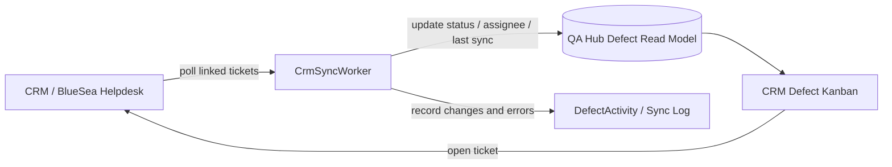

# CRM Defect Kanban Board — แผนการพัฒนา

> สถานะ: **Planning only**  
> วันที่จัดทำ: 2026-09-21  
> ขอบเขตเริ่มต้น: แสดง Defect ที่เชื่อมกับ CRM ใน QA Hub เป็น Kanban สำหรับติดตามงาน

## 1. สรุป

ต้องการนำข้อมูล Defect จาก CRM/BlueSea Helpdesk มาแสดงเป็น Kanban Board เพื่อให้ทีม QA และ Development เห็นงานค้าง ผู้รับผิดชอบ สถานะ และอายุของ Defect ในหน้าเดียว

ระบบปัจจุบันมีฐานรองรับแล้ว ได้แก่ `Defect.CrmTicketId`, `CrmSyncStatus`, สถานะล่าสุดจาก CRM, `CrmSyncWorker` และ `DefectActivity` สำหรับบันทึกการเปลี่ยนแปลง ดังนั้นระยะเริ่มต้นควรใช้ข้อมูล Defect ใน QA Hub เป็น Local Read Model แล้วให้ CRM เป็นแหล่งสถานะของ Ticket

เอกสารที่เกี่ยวข้อง:

- `Document/03-Architecture-and-Plan/CRM_INTEGRATION_PLAN.md`
- `src/ProMaxx2.QA.Api/Services/CrmSyncService.cs`
- `src/ProMaxx2.QA.Api/Services/CrmApiClient.cs`
- `src/ProMaxx2.QA.Infrastructure/Persistence/DefectConfiguration.cs`

## 2. เป้าหมาย

1. เห็น Defect ที่เกี่ยวข้องกับ CRM แยกตามสถานะบน Board
2. ค้นหาและกรองตาม Project, Release, Build, Module, Severity, Priority และ Assignee
3. เปิดรายละเอียด Defect และ CRM Ticket ได้จาก Card
4. เห็นสถานะ Sync ล่าสุดและข้อมูลที่ค้างหรือ Sync ไม่สำเร็จ
5. เก็บประวัติการเปลี่ยนสถานะเพื่อวิเคราะห์ Aging และ SLA ในระยะถัดไป

## 3. ขอบเขตระยะเริ่มต้น

### ทำใน MVP

- แสดงเฉพาะ Defect ที่มี `CrmTicketId` และยังไม่ถูกลบ
- ใช้ข้อมูลล่าสุดที่ Sync เข้า QA Hub เป็นฐานการแสดงผล
- แสดง Board แบบ Read-only ก่อน
- เปิด Defect Detail และลิงก์ไป CRM Ticket
- แสดงจำนวน Card ต่อคอลัมน์และจำนวนรวมตาม Filter
- รองรับสถานะ CRM ที่ไม่รู้จักด้วยคอลัมน์ `Unknown`
- แสดงเวลาที่ Sync ล่าสุดและสถานะ Sync Error

### ยังไม่รวมใน MVP

- การลาก Card เพื่อเปลี่ยนสถานะ CRM
- การดึง CRM Ticket ทั้งระบบที่ยังไม่เคยผูกกับ QA Hub
- การแก้ข้อมูล CRM จาก Board
- การคำนวณ SLA ที่ต้องอาศัยประวัติย้อนหลังทั้งหมด

## 4. ข้อสรุปเชิงสถาปัตยกรรม

### 4.1 แหล่งข้อมูล

- CRM เป็น Source of Truth สำหรับ `CRM Status`, CRM Assignee และข้อมูล Ticket ที่ CRM เป็นผู้ดูแล
- QA Hub เป็น Source of Truth สำหรับ `Defect ID`, Severity, Module, Test Case, Release/Build และความสัมพันธ์กับการทดสอบ
- Board อ่านจากฐานข้อมูล QA Hub ไม่เรียก CRM ตรงในทุก Card เพื่อให้โหลดเร็วและไม่ผูก UI กับ Credential ของ CRM

### 4.2 รูปแบบการ Sync



รอบ Sync ให้ใช้กลไกเดิมของ `CrmSyncWorker` ก่อน โดยเพิ่มการอ่านข้อมูลที่จำเป็นกับ Board และรักษา Retry/Logging เดิม

### 4.3 ขอบเขตข้อมูล

#### MVP: Linked Defect Board

ใช้ตาราง `Defects` เดิมและไม่สร้างข้อมูลซ้ำใน CRM โดยเพิ่ม Query/DTO สำหรับ Kanban โดยเฉพาะ

#### กรณีต้องการดึง CRM Ticket ทั้งหมด

ต้องมี API จาก CRM สำหรับ List/Search และ Pagination ก่อน หากมีจริงจึงค่อยเพิ่ม Local Mirror เช่น `CrmTicketSnapshots` โดยใช้ `CrmTicketId` เป็น Unique Key และผูกกับ `DefectId` ได้เมื่อพบความสัมพันธ์

หาก CRM ไม่มี List/Search API จะรองรับได้เฉพาะ Ticket ที่ถูกส่งจาก QA Hub หรือรายการที่ผู้ใช้ Import ตามช่องทางที่ตกลงกัน

## 5. การ Map สถานะ CRM เป็นคอลัมน์

Mapping ต้องเก็บเป็น Configuration ไม่เขียนตายตัวในหน้าเว็บ เพื่อให้ปรับตามกระบวนการของทีมได้

| กลุ่ม Kanban | สถานะ CRM ตัวอย่าง | ความหมาย |
|---|---|---|
| New | `Open` | รับเรื่องแล้ว ยังไม่ได้เริ่มดำเนินการ |
| Assigned | `Approve`, `Planning` | มีผู้รับผิดชอบหรืออยู่ระหว่างวางแผน |
| In Progress | `Continue`, `Develop` | กำลังแก้ไขหรือดำเนินงาน |
| Ready for QA | `Test` | รอ QA ตรวจสอบ |
| Rework | `EditErr` | QA พบปัญหาและส่งกลับแก้ไข |
| Closed | สถานะปิดงานที่ CRM ยืนยัน | งานเสร็จสิ้น |
| Unknown | สถานะที่ยังไม่ได้ Map | ต้องให้ Admin ตรวจสอบ |

ชื่อสถานะจริงและสถานะปิดงานต้องยืนยันกับทีม CRM ก่อน Implement

## 6. รูปแบบ UI Kanban

### 6.1 Header และ Filter

- Project / Release / Build Context เดียวกับหน้า Defect
- Filter: Module, Severity, Priority, Assignee, CRM Status, QA Status, Sync Status
- Search: Defect Code, CRM Ticket, Title
- แสดง `Last synced` และปุ่ม Refresh เฉพาะเมื่อมีสิทธิ์ที่เหมาะสม
- แสดง Banner เมื่อข้อมูลอาจไม่สดหรือ Sync มีปัญหา

### 6.2 Kanban Column

- ชื่อคอลัมน์และจำนวน Card
- จำนวนรวมต้องคำนวณจาก Filter ปัจจุบัน
- มี Internal Horizontal Scroll เฉพาะพื้นที่ Board และห้ามทำให้เกิด Page-level Horizontal Scroll
- รองรับ Empty State และ Loading State ต่อคอลัมน์
- คอลัมน์ `Unknown` ต้องแสดงเสมอเมื่อมีสถานะที่ยังไม่ถูก Map

### 6.3 Card

แสดงข้อมูลที่ช่วยตัดสินใจได้ทันที:

- Defect Code และ CRM Ticket No.
- Title แบบแสดงครบหรือเปิดดูเต็มได้
- Severity / Priority
- Module
- Release / Build
- Assignee
- อายุของ Defect
- CRM Status
- เวลาที่ Sync ล่าสุด
- Badge แจ้ง Sync Error, Stale หรือไม่มี Assignee

### 6.4 Detail Drawer / Modal

- รายละเอียด Defect เดิมใน QA Hub
- สถานะ CRM และ QA แยกกันชัดเจน
- Release / Build / Module / Assignee
- Activity Timeline รวมเหตุการณ์จาก QA Hub และ CRM Comment
- ปุ่ม `เปิด CRM Ticket`
- ปุ่มแก้ไข Defect จำกัดตาม Permission เดิม
- ระบุแหล่งข้อมูลและเวลาที่อัปเดตล่าสุด

### 6.5 Responsive และ Accessibility

- Desktop ใช้หลายคอลัมน์และ Scroll ภายใน Board
- Mobile เปลี่ยนเป็นคอลัมน์เลื่อนแนวนอนภายในพื้นที่ที่กำหนด หรือมุมมอง List ตามความเหมาะสม
- ทุก Card เปิดด้วย Keyboard ได้
- ใช้สีร่วมกับข้อความ/Badge ไม่ใช้สีเป็นตัวบอกสถานะเพียงอย่างเดียว
- ชื่อยาวต้อง wrap ได้และไม่ทำให้หน้าเกิด Horizontal Scroll

## 7. API และ Backend ที่เสนอ

### MVP Endpoint

```text
GET /defects/kanban
```

Query ที่รองรับ:

```text
projectId, releaseId, buildId, moduleId,
severity, priority, assigneeUserId,
crmStatus, qaStatus, syncStatus, search
```

Response ควรมี:

```text
columns[]
  key
  label
  count
  items[]
    defectId
    defectCode
    crmTicketId
    title
    severity
    priority
    status
    crmStatus
    moduleName
    releaseCode
    buildNumber
    assigneeName
    crmLastSyncedAt
    syncStatus
    ageInDays
```

### Endpoint ที่อาจเพิ่มในระยะถัดไป

```text
GET  /defects/kanban/config
PUT  /defects/kanban/config
POST /defects/{id}/crm-status
GET  /defects/{id}/crm-history
```

การเปลี่ยนสถานะจาก QA Hub ต้องทำหลังจากยืนยัน CRM API, Permission และ Conflict Handling แล้วเท่านั้น

## 8. Data Model ที่เสนอ

### ใช้ของเดิมใน MVP

- `Defects.CrmTicketId`
- `Defects.CrmSyncStatus`
- `Defects.CrmLastSyncedAt`
- `Defects.CrmLastKnownStatus`
- `Defects.CrmLastKnownAssignto`
- `DefectActivity`

### ตารางที่อาจเพิ่ม

| ตาราง | ใช้เมื่อ | หน้าที่ |
|---|---|---|
| `CrmStatusMappings` | ต้องให้ Admin ปรับ Mapping | เก็บ CRM Status → Kanban Column |
| `CrmSyncRuns` | ต้องดูภาพรวมการ Sync | เก็บเวลาเริ่ม/จบ จำนวนสำเร็จ/ล้มเหลว |
| `CrmTicketSnapshots` | ต้อง Import Ticket ทั้ง CRM | เก็บ Local Mirror ของ Ticket ที่ไม่มี Defect ใน QA Hub |
| `DefectStatusHistory` | ต้องวัด Aging/SLA อย่างละเอียด | เก็บช่วงเวลาที่ Defect อยู่แต่ละสถานะ |

ไม่ควรสร้างตารางทั้งหมดตั้งแต่ MVP หากยังใช้ Board จาก Defect ที่เชื่อมอยู่แล้วได้

## 9. Permission และ Audit

- ดู Board ใช้ Permission การดู Defect
- แก้ Filter/Mapping ใช้สิทธิ์ Admin หรือสิทธิ์เฉพาะที่กำหนด
- เปิด CRM Ticket ต้องไม่เปิดเผย Credential หรือ Token ใน Client
- การเปลี่ยนสถานะจาก Board ต้องบันทึกผู้ทำ เวลา ค่าเดิม ค่าใหม่ และผลตอบกลับจาก CRM
- Sync Error ต้องไม่ทำให้ข้อมูลเดิมหาย ควรคงค่า Last Known และแสดงสถานะ Stale

## 10. แผนแบ่ง Phase

### Phase 0 — Confirm Integration Contract

- ยืนยันรายการ CRM Status จริง
- ยืนยันสถานะปิดงาน
- ยืนยัน API List/Search หากต้องการนำเข้า Ticket ทั้งหมด
- ยืนยัน Rate Limit และ Credential สำหรับ Poll
- กำหนด Mapping Project → CRM Product และ Release/Build → CRM Version

**ผลลัพธ์:** ได้ Contract และ Mapping ที่ทีม CRM/QA รับรองร่วมกัน

### Phase 1 — Linked Defect Kanban MVP

- เพิ่ม Query/DTO สำหรับ Kanban
- ทำ Board Read-only
- เพิ่ม Filter, Search, Card และ Detail Drawer
- แสดง Last Sync, Sync Error และ Unknown Status
- เปิด CRM Ticket จาก Card

**ผลลัพธ์:** ติดตาม Defect ที่ส่งเข้า CRM แล้วได้จาก QA Hub หน้าเดียว

### Phase 2 — Configurable Mapping และ History

- เพิ่มหน้า Admin สำหรับ Mapping สถานะ
- เก็บ Sync Run Summary
- เก็บ Status History
- เพิ่ม Aging และ SLA Indicator
- เพิ่ม Export รายการตาม Filter

### Phase 3 — Controlled CRM Update

- เพิ่มการเปลี่ยนสถานะจาก Board
- ตรวจ Permission และสถานะล่าสุดก่อน Update
- รองรับ Conflict, Retry และ Error Recovery
- เพิ่ม Audit และ Activity ที่ตรวจสอบย้อนกลับได้

### Phase 4 — Full CRM Import (Optional)

- ทำเมื่อ CRM มี List/Search API ที่เหมาะสม
- เพิ่ม `CrmTicketSnapshots`
- รองรับ Ticket ที่ยังไม่มี QA Defect
- เพิ่มกระบวนการ Link/Unlink กับ Defect ใน QA Hub

## 11. Acceptance Criteria

### MVP

- Card ที่แสดงบน Board ตรงกับ Defect ที่ผ่าน Filter
- Defect หนึ่งรายการไม่ซ้ำข้ามคอลัมน์
- CRM Status ที่ไม่รู้จักไปอยู่ `Unknown` และไม่หายจากผลลัพธ์
- Card แสดง CRM Ticket, Assignee, Release/Build และ Last Sync ได้ถูกต้อง
- เปิดรายละเอียด Defect และ CRM Ticket ได้
- Sync Error/Stale แสดงชัดเจนและไม่ลบสถานะล่าสุดเดิม
- Refresh แล้วข้อมูลยังคงสอดคล้องกับฐานข้อมูล
- Desktop และ Mobile ไม่เกิด Page-level Horizontal Scroll
- ผู้ไม่มีสิทธิ์แก้ไขไม่เห็นปุ่มเปลี่ยน Mapping หรือเปลี่ยนสถานะ

### ก่อนเปิดใช้งานจริง

- ทดสอบ Token หมดอายุ, CRM Timeout, Rate Limit และ Response ผิดรูปแบบ
- ทดสอบข้อมูล CRM Status ใหม่ที่ยังไม่อยู่ใน Mapping
- ทดสอบ Defect ถูกลบ/ปิดใช้งานระหว่าง Sync
- ทดสอบข้อมูลจำนวนมากและการแบ่งหน้า/Virtualization ของ Board
- ทดสอบ Audit Log และการป้องกัน Credential รั่วใน Browser/Log

## 12. ความเสี่ยงและแนวทางรับมือ

| ความเสี่ยง | ผลกระทบ | แนวทางรับมือ |
|---|---|---|
| CRM ไม่มี List/Search API | ดึง Ticket ทั้งหมดไม่ได้ | เริ่มจาก Linked Defect หรือใช้ Export ที่ตกลงกัน |
| สถานะ CRM เปลี่ยนหรือมีค่าใหม่ | Card ไปผิดคอลัมน์ | ใช้ Mapping Configuration และ Unknown Column |
| CRM Sync ช้า/ล้มเหลว | Board แสดงข้อมูลไม่สด | แสดง Last Sync/Stale และเก็บ Last Known Value |
| แก้สถานะพร้อมกันสองระบบ | ข้อมูลทับกัน | Read-only ใน MVP และใช้ Optimistic Concurrency ใน Phase 3 |
| Ticket จำนวนมาก | Board โหลดช้า | Query server-side, filter ก่อนโหลด และใช้ internal scroll/virtualization |
| Credential รายบุคคลไม่พร้อม | Poll บางรายการล้มเหลว | แสดง Sync Error รายรายการและไม่หยุดทั้ง Worker |

## 13. รายการคำถามที่ต้องยืนยันก่อนเริ่ม Implement

1. ต้องการ Board เฉพาะ Defect ที่สร้างจาก QA Hub หรือ Ticket ทั้งหมดจาก CRM
2. สถานะใดถือเป็น Closed/Done ใน CRM
3. ต้องการให้ Drag & Drop เปลี่ยนสถานะ CRM หรือใช้ดูอย่างเดียว
4. ใครมีสิทธิ์แก้ Status Mapping
5. ต้องการ WIP Limit ต่อคอลัมน์หรือไม่
6. SLA นับจากวันที่สร้างใน QA Hub หรือวันที่สร้าง CRM Ticket
7. ต้องการแยก Board ตาม Project, Release หรือ Build หรือใช้ Filter ร่วมกัน
8. CRM มี API สำหรับ List/Search Job และมีข้อจำกัดจำนวน Request เท่าใด

## 14. Definition of Done สำหรับ MVP

- Contract และ Status Mapping ผ่านการยืนยันจาก QA/Development/CRM
- API Kanban มี Filter ที่ระบุไว้และมี Test ครบกรณีหลัก
- UI รองรับ Loading, Empty, Error, Unknown และ Stale State
- Card เปิด Defect Detail และ CRM Ticket ได้
- ไม่เรียก CRM โดยตรงจาก Browser
- มี Log สำหรับ Sync Error และไม่เปิดเผย Credential
- ผ่าน `npm.cmd run build`, `npm.cmd run lint` และ `git diff --check`
- มีคู่มือการตั้งค่าและวิธีตรวจสอบ Last Sync สำหรับผู้ดูแลระบบ

## 15. สถานะเอกสาร

- [x] บันทึกแนวทาง MVP แบบ Linked Defect
- [x] ระบุข้อจำกัด CRM List/Search API
- [x] วาง Phase การพัฒนา
- [ ] ยืนยัน CRM Status Mapping กับผู้ดูแล CRM
- [ ] ยืนยันความต้องการ Board Read-only หรือแก้สถานะได้
- [ ] ยืนยัน Scope ว่ารวม Ticket ที่ยังไม่มี QA Defect หรือไม่
